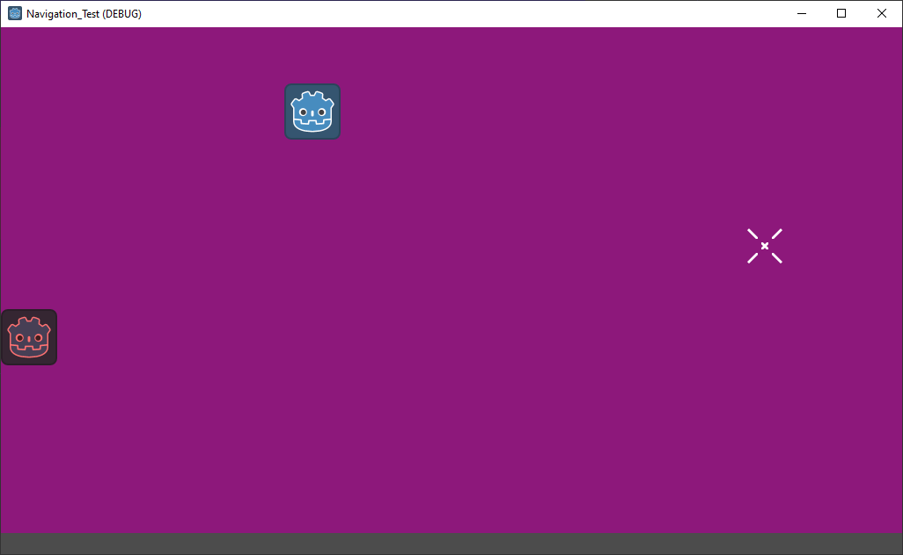
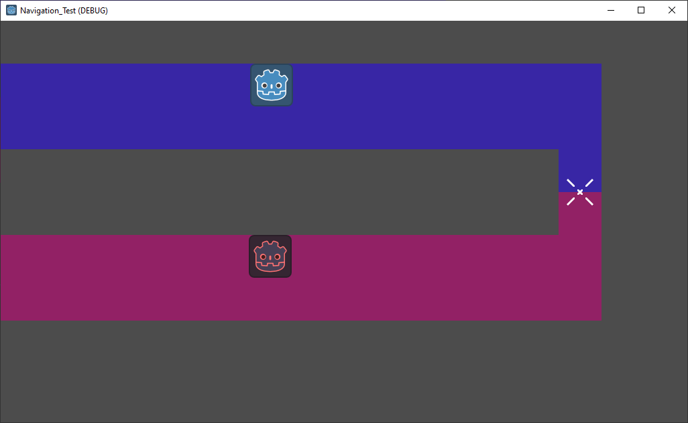

# Godot Navigation Regions Test
The purpose of this sample project is to examine Godot's behavior (on v3.5) with overlapping navigation regions on different layers. I have created two scenes, each with two tilemaps that have navigation shapes on the tiles. The two tilemaps are assigned different navigation layers (1 and 2), and then two sprites are placed in the level and each attempts to use `Navigation2DServer.map_get_path` to generate a path towards a shared goal, but one is using layer 1, and the other is using layer 2.

The two scenes are different in that `TestScene1` has the two tilemaps overlapping completely:

And `TestScene2` has no areas of overlap, with the goal sitting between the two tilemaps:

What I thought would be the behavior is that these regions are kept seperate and independently navigable from the `Navigation2DServer`, even over the sections that overlap. What seems to be the case instead is that the layers are merged where they overlap, and the region gets the navigation layer of whichever TileMap is first on the scene tree. This results in one of the sprites being able to generate a path, and the other one getting an empty array.

I'm wondering if this is the intended behavior, or if there is some way that I am missing to be able to keep the two navigation layers seperate and achieve the navigation from both sprites.